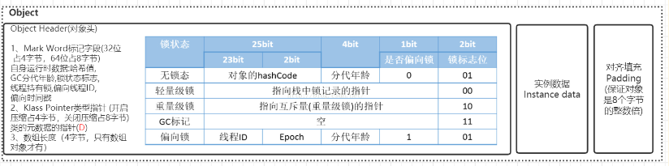
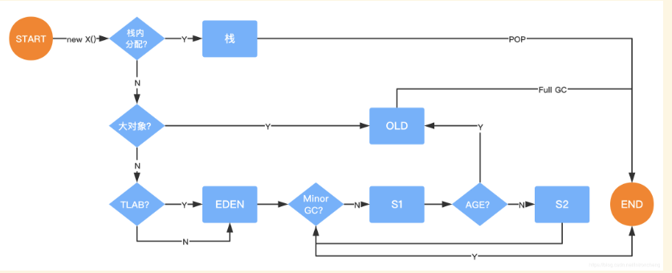
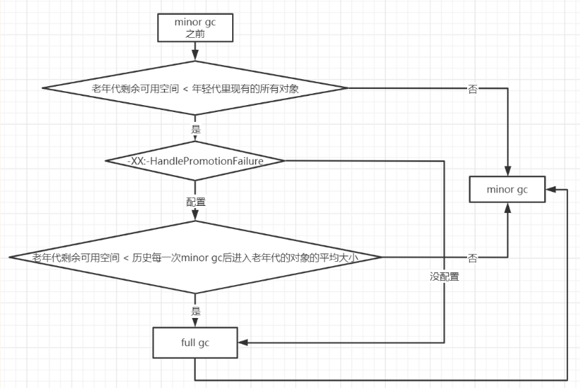

# JVM内存模型


# Java对象

## Java对象加载

一个对象被使用需要先加载类，即先走类的加载流程为：加载 >> 验证 >> 准备 >> 解析 >> 初始化 >> 使用 >> 卸载
- 加载：在硬盘上通过IO读取字节码文件。
- 验证：校验字节码文件的正确性。
- 准备：给类的静态变量赋予默认值，并分配内存。
- 解析：将符号引用替换为直接引用。
- 初始化：对类的静态变量初始化为指定的值，并执行静态代码块。

## Java对象的对象头



### 对象中的指针压缩
1. 什么是指针压缩？
    1. jdk1.6 update14开始，在64bit操作系统中，JVM支持指针压缩
    2. jvm配置参数:UseCompressedOops，compressed压缩、oop(ordinary object pointer)对象指针
    3. 启用指针压缩:XX:+UseCompressedOops(默认开启)，禁止指针压缩:XX:-UseCompressedOops
2. 为什么要进行指针压缩？
    1. 在64位平台的HotSpot中使用32位指针，内存使用会多出1.5倍左右，使用较大指针在主内存和缓存之间移动数据，占用较大宽带，同时GC也会承受较大压力
    2. 为了减少64位平台下内存的消耗，启用指针压缩功能
    3. 在jvm中，32位地址最大支持4G内存(2的32次方)，可以通过对对象指针的压缩编码、解码方式进行优化，使得jvm只用32位地址就可以支持更大的内存配置(小于等于32G)
    4. 堆内存小于4G时，不需要启用指针压缩，jvm会直接去除高32位地址，即使用低虚拟地址空间
    5. 堆内存大于32G时，压缩指针会失效，会强制使用64位(即8字节)来对java对象寻址，这就会出现1的问题，所以堆内存不要大于32G为好

## Java的对象内存分配

### 对象内存分配流程图



### 对象栈上分配

我们通过JVM内存分配可以知道JAVA中的对象都是在堆上进行分配，当对象没有被引用的时候，需要依靠GC进行回收内存，如果对象数量较多的时候，会给GC带来较大压力，也间接影响了应用的性能。为了减少临时对象在堆内分配的数量，JVM通过**逃逸分析**确定该对象不会被外部访问。如果**不会逃逸可以将该对象在栈上分配内存**，这样该对象所占用的内存空间就可以随栈帧出栈而销毁，就减轻了垃圾回收的压力。
**对象逃逸分析**：就是分析对象动态作用域，当一个对象在方法中被定义后，它可能被外部方法所引用，例如作为调用参数传递到其他地方中。JVM对于这种情况可以通过开启逃逸分析参数(-XX:+DoEscapeAnalysis)来优化对象内存分配位置，使其通过标量替换优先分配在栈上(栈上分配)，JDK7之后默认开启逃逸分析，如果要关闭使用参数(-XX:-DoEscapeAnalysis)。
**标量替换**：通过逃逸分析确定该对象不会被外部访问，并且对象可以被进一步分解时，JVM不会创建该对象，而是将该对象成员变量分解若干个被这个方法使用的成员变量所代替，这些代替的成员变量在栈帧或寄存器上分配空间，这样就不会因为没有一大块连续空间导致对象内存不够分配。开启标量替换参数(-XX:+EliminateAllocations)，JDK7之后默认开启。
**标量与聚合量**：标量即不可被进一步分解的量，而JAVA的基本数据类型就是标量（如：int，long等基本数据类型以及reference类型等），标量的对立就是可以被进一步分解的量，而这种量称之为聚合量。而在JAVA中对象就是可以被进一步分解的聚合量。
> 结论：栈上分配依赖于逃逸分析和标量替换

### 对象在Eden区分配

大多数情况下，对象在新生代中 Eden 区分配。当 Eden 区没有足够空间进行分配时，虚拟机将发起一次Minor GC。我们来进行实际测试一下。
在测试之前我们先来看看 Minor GC和Full GC 有什么不同呢？
- Minor GC/Young GC：指发生新生代的的垃圾收集动作，Minor GC非常频繁，回收速度一般也比较快。
- Major GC/Full GC：一般会回收老年代 ，年轻代，方法区的垃圾，Major GC的速度一般会比Minor GC的慢10倍以上。
  Eden与Survivor区默认8:1:1。
  大量的对象被分配在eden区，eden区满了后会触发minor gc，可能会有99%以上的对象成为垃圾被回收掉，剩余存活的对象会被挪到为空的那块survivor区，下一次eden区满了后又会触发minor gc，把eden区和survivor区垃圾对象回收，把剩余存活的对象一次性挪动到另外一块为空的survivor区，因为新生代的对象都是朝生夕死的，存活时间很短，所以JVM默认的8:1:1的比例是很合适的，让eden区尽量的大，survivor区够用即可，JVM默认有这个参数-XX:+UseAdaptiveSizePolicy(默认开启)，会导致这个8:1:1比例自动变化，如果不想这个比例有变化可以设置参数-XX:-UseAdaptiveSizePolicy。

### 大对象直接进入老年代

大对象就是需要大量连续内存空间的对象（比如：字符串、数组）。JVM参数 -XX:PretenureSizeThreshold 可以设置大对象的大小，如果对象超过设置大小会直接进入老年代，不会进入年轻代，这个参数只在 Serial 和ParNew两个收集器下有效。
比如设置JVM参数：-XX:PretenureSizeThreshold=1000000 (单位是字节) -XX:+UseSerialGC ，再执行下上面的第一个程序会发现大对象直接进了老年代。
> 为什么要这样呢？
> 为了避免为大对象分配内存时的复制操作而降低效率。

### 长期存活的对象将进入老年代

既然虚拟机采用了分代收集的思想来管理内存，那么内存回收时就必须能识别哪些对象应放在新生代，哪些对象应放在老年代中。为了做到这一点，虚拟机给每个对象一个对象年龄（Age）计数器。
如果对象在 Eden 出生并经过第一次 Minor GC 后仍然能够存活，并且能被 Survivor 容纳的话，将被移动到  Survivor空间中，并将对象年龄设为1。对象在 Survivor 中每熬过一次 MinorGC，年龄就增加1岁，当它的年龄增加到一定程度（默认为15岁，CMS收集器默认6岁，不同的垃圾收集器会略微有点不同），就会被晋升到老年代中。对象晋升到老年代的年龄阈值，可以通过参数 -XX:MaxTenuringThreshold 来设置。

### 对象动态年龄判断

当前放对象的Survivor区域里(其中一块区域，放对象的那块s区)，一批对象的总大小大于这块Survivor区域内存大小的50%(-XX:TargetSurvivorRatio可以指定)，那么此时大于等于这批对象年龄最大值的对象，就可以直接进入老年代了，
例如Survivor区域里现在有一批对象，年龄1+年龄2+年龄n的多个年龄对象总和超过了Survivor区域的50%，此时就会把年龄n(含)以上的对象都放入老年代。这个规则其实是希望那些可能是长期存活的对象，尽早进入老年代。**对象动态年龄判断机制一般是在minor gc之后触发的。**

### 老年代空间分配担保机制

年轻代每次minor gc之前JVM都会计算下老年代剩余可用空间
如果这个可用空间小于年轻代里现有的所有对象大小之和(包括垃圾对象)
就会看一个“-XX:-HandlePromotionFailure”(jdk1.8默认就设置了)的参数是否设置了
如果有这个参数，就会看看老年代的可用内存大小，是否大于之前每一次minor gc后进入老年代的对象的平均大小。如果上一步结果是小于或者之前说的参数没有设置，那么就会触发一次Full gc，对老年代和年轻代一起回收一次垃圾，如果回收完还是没有足够空间存放新的对象就会发生"OOM"
当然，如果minor gc之后剩余存活的需要挪动到老年代的对象大小还是大于老年代可用空间，那么也会触发full  gc，full gc完之后如果还是没有空间放minor gc之后的存活对象，则也会发生“OOM”



## 对象内存回收

堆中几乎放着所有的对象实例，对堆垃圾回收前的第一步就是要判断哪些对象已经死亡（即不能再被任何途径使用的对象），这个有引用计数法和可达性分析算法。

### 引用计数法

给对象中添加一个引用计数器，每当有一个地方引用它，计数器就加1；当引用失效，计数器就减1；任何时候计数器为0的对象就是不可能再被使用的。
**这个方法实现简单，效率高，但是目前主流的虚拟机中并没有选择这个算法来管理内存，其最主要的原因是它很难解决对象之间相互循环引用的问题。** 所谓对象之间的相互引用问题，如下面代码所示：除了对象objA 和 objB 相互引用着对方之外，这两个对象之间再无任何引用。但是他们因为互相引用对方，导致它们的引用计数器都不为0，于是引用计数算法无法通知 GC 回收器回收他们。

### 可达性分析算法

将“GC Roots” 对象作为起点，从这些节点开始向下搜索引用的对象，找到的对象都标记为非垃圾对象，其余未标记的对象都是垃圾对象
**GC Roots根节点：线程栈的本地变量、静态变量、本地方法栈的变量等等**

### 常见的引用类型

java的引用类型一般分为四种：**强引用、软引用**、弱引用、虚引用

**强引用**：普通的变量引用，即等号
```java
public static User user = new User();
```

**软引用**：将对象用SoftReference软引用类型的对象包裹，正常情况不会被回收，但是GC做完后发现释放不出空间存放新的对象，则会把这些软引用的对象回收掉。**软引用可用来实现内存敏感的高速缓存。**
```java
public static SoftReference<User> user = new SoftReference<User>(new User()); // 其中new的User对象就是软引用
```
软引用在实际中有重要的应用，例如浏览器的后退按钮。按后退时，这个后退时显示的网页内容是重新进行请求还是从缓存中取出呢？这就要看具体的实现策略了。
（1）如果一个网页在浏览结束时就进行内容的回收，则按后退查看前面浏览过的页面时，需要重新构建
（2）如果将浏览过的网页存储到内存中会造成内存的大量浪费，甚至会造成内存溢出

**弱引用**：将对象用WeakReference软引用类型的对象包裹，弱引用跟没引用差不多，GC会直接回收掉，很少用
```java
public static WeakReference<User> user = new WeakReference<User>(new User());
```

**虚引用**：虚引用也称为幽灵引用或者幻影引用，它是最弱的一种引用关系，几乎不用

### finalize()方法判断对象是否存活

即使在可达性分析算法中不可达的对象，也并非是“非死不可”的，这时候它们暂时处于“缓刑”阶段，要真正宣告一个对象死亡，至少要经历再次标记过程。
**标记的前提是对象在进行可达性分析后发现没有与GC Roots相连接的引用链。**

1. 第一次标记并进行一次筛选。
   筛选的条件是此对象是否有必要执行finalize()方法。
   当对象没有覆盖finalize方法，对象将直接被回收。
2. 第二次标记
   如果这个对象覆盖了finalize方法，finalize方法是对象脱逃死亡命运的最后一次机会，如果对象要在finalize()中成功拯救自己，只要重新与引用链上的任何的一个对象建立关联即可，譬如把自己赋值给某个类变量或对象的成员变量，那在第二次标记时它将移除出“即将回收”的集合。如果对象这时候还没逃脱，那基本上它就真的被回收了。
   注意：一个对象的finalize()方法只会被执行一次，也就是说通过调用finalize方法自我救命的机会就一次。
```java
public class OOMTest {

public static void main(String[] args) {
	List<Object> list = new ArrayList<>();
	int i = 0;
	int j = 0;
	while (true) {
		list.add(new User(i++, UUID.randomUUID().toString()));
		new User(j--, UUID.randomUUID().toString());
		}
	}
}
```

### 判断一个加载进入方法区中的类是一个无用的类

方法区主要回收的是无用的类，那么如何判断一个类是无用的类的呢？
类需要同时满足下面3个条件才能算是 “无用的类” ：
- 该类所有的实例都已经被回收，也就是 Java 堆中不存在该类的任何实例。
- 加载该类的 ClassLoader 已经被回收。
- 该类对应的 java.lang.Class 对象没有在任何地方被引用，无法在任何地方通过反射访问该类的方法。