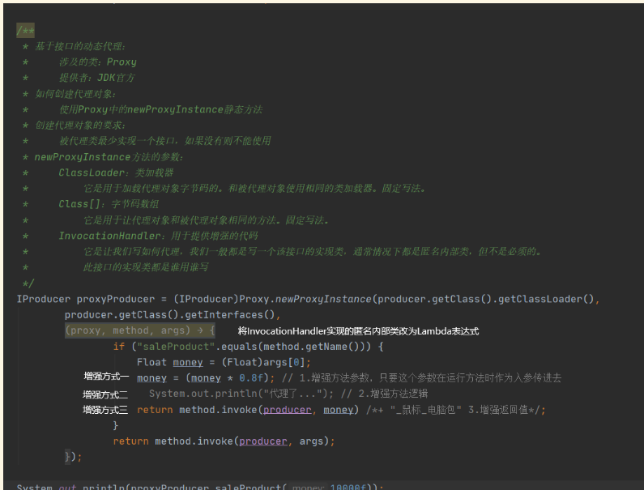
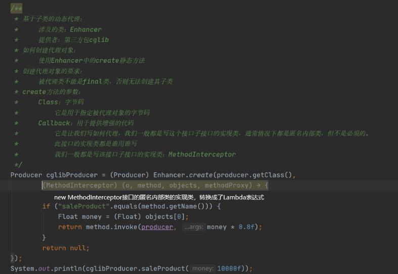

# 实现

## Java中的实现

### 概念

1.真实对象：被代理的对象
2.代理对象：对正式对象增强过后的对象
3.代理模式：代理对象代理真实的对象达到增强真实对象功能的目的

### 实现方式

1. 静态代理：有一个类文件描述代理模式。

2. 动态代理：在内存中形成代理类。
   实现步骤：
   1.代理对象和真实对象实现相同的接口
   2.代理对象 = Proxy.newProxyInstance()
   3.使用代理对象调用方法
   4.增强方法

   增强方式：
   1.增强入参列表
   2.增强返回值
   3.增强方法体执行逻辑

   特点：字节码随用随创建，随用随加载

   作用：不修改源码的基础上对方法增强

   分类：
   基于接口的动态代理
   基于子类的动态代理
### 基于接口的动态代理

涉及的类：Proxy
提供者：JDK官方
如何创建代理对象：
使用Proxy中的newProxyInstance静态方法 
创建代理对象的要求：
被代理类最少实现一个接口，如果没有则不能使用
newProxyInstance方法的参数：
ClassLoader：类加载器
它是用于加载代理对象字节码的。和被代理对象使用相同的类加载器。固定写法。`被代理对象.getClass().getClassLoader()`
Class[]：字节码数组
	        它是用于让代理对象和被代理对象相同的方法。固定写法。`被代理对象.getClass().getInterfaces()`
InvocationHandler：用于提供增强的代码
	        它是让我们写如何代理，我们一般都是写一个该接口的实现类，通常情况下都是匿名内部类，但不是必须的。
	        此接口的实现类都是谁用谁写
```java
		new InvocationHandler() {
		/**
		 * 作用：执行被代理对象的任何接口方法都会经过该方法
		 * 方法参数的含义
		 * @param proxy     代理对象的引用
		 * @param method    当前执行的方法
		 * @param args      当前执行方法所需的参数
		 * @return          和被代理对象方法有相同类型的返回值，也可以增强
		 * @throws Throwable
		 */
		public Object invoke(Object proxy, Method method, Object[] args) throws Throwable {
			if ("saleProduct".equals(method.getName())) {
				Float money = (Float)args[0];
				money = (money * 0.8f); // 增强方法参数，只要这个参数在运行方法时作为入参传进去
//                            System.out.println("代理了..."); // 增强方法逻辑
				return method.invoke(producer, money) /*+ "_鼠标_电脑包" 增强返回值*/;
			}
			return method.invoke(producer, args);
		}
	}
```
代码示例


### 基于子类的动态代理

涉及的类：Enhancer
提供者：第三方cglib
如何创建代理对象：
使用Enhancer类中的create静态方法
创建代理对象的要求：
被代理类不能是final类，否则无法创建其子类
create方法参数：
Class：字节码
它是用于指定被代理对象的字节码。固定写法。`被代理对象.getClass()`
Callback：用于提供增强的代码
	        它是让我们如何写代理，我们一般都是写这个接口的子接口的实现类，通常情况下都是匿名内部类，但不是必须的。
	        此接口的实现类是谁用谁写。
	        我们一般都是写该接口子接口的实现类：MethodInterceptor
```java
		new MethodInterceptor() {
		    /**
		     * 作用：执行被代理对象的任何接口方法都会经过该方法
		     * 方法参数的含义
		     * @param o             代理对象的引用，相当于new InvocationHandler的invoke方法中的proxy参数
		     * @param method        当前执行的方法，相当于new InvocationHandler的invoke方法中的method参数
		     * @param objects       当前执行方法所需的参数，相当于new InvocationHandler的invoke方法中的args参数
		     * @param methodProxy   当前执行方法的代理对象
		     * @return              和被代理对象方法有相同类型的返回值，也可以增强
		     * @throws Throwable
		     */
		
		    public Object intercept(Object o, Method method, Object[] objects, MethodProxy methodProxy) throws Throwable {
		        if ("saleProduct".equals(method.getName())) {
		            Float money = (Float) objects[0];
		            return method.invoke(producer, money * 0.8f);
		        }
		        return null;
		    }
		}
```
代码示例


